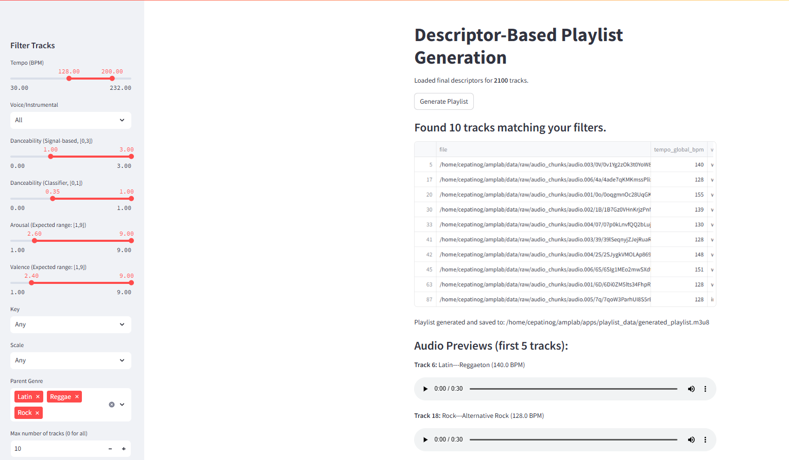
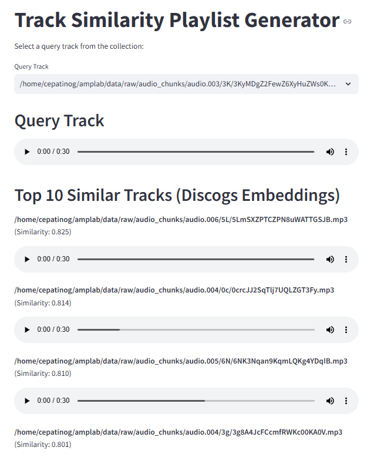

# Amplab Essentia Music Analysis

This project is a modular system for audio analysis, statistical exploration, and playlist generation based on extracted musical features. The system leverages state-of-the-art audio analysis tools such as Essentia and pre-trained TensorFlow models to compute descriptors like tempo, key, loudness, emotion (arousal/valence), danceability, music style (genre), and embeddings for similarity comparisons. Two interactive Streamlit apps allow users to generate playlists either by filtering descriptors or by computing track similarity.

## Table of Contents
- [Features](#features)
- [Project Structure](#project-structure)
- [Installation](#installation)
- [Usage](#usage)
  - [Audio Feature Extraction](#audio-feature-extraction)
  - [Statistical Analysis](#statistical-analysis)
  - [Playlist Generation UIs](#playlist-generation-uis)
- [Dependencies](#dependencies)
- [License](#license)

## Features
### Feature Extraction:
- **Tempo**: Global BPM and local tempo probabilities via TempoCNN.
- **Key & Scale**: Key estimation using three profiles (Temperley, Krumhansl, EDMA).
- **Loudness**: Integrated, short‑term, and momentary loudness (LUFS) plus loudness range.
- **Genre Prediction**: Activations from a Discogs‑Effnet model (400 music styles) with extraction of parent genres.
- **Voice/Instrumental Classification**: Binary classification based on Discogs‑Effnet embeddings.
- **Danceability**: Two modes (signal‑based and classifier‑based).
- **Emotion**: Arousal/valence prediction using an MSD‑MusicCNN embedding and a regression model.
- **Embeddings**: Extraction of two sets of embeddings (Discogs‑Effnet and MSD‑MusicCNN) for music similarity.

### Statistical Analysis:
Notebooks generate plots and overviews of the collection’s descriptors (e.g., tempo, loudness, key/scale distributions, emotion space, genre distribution).

### Interactive UIs:
Two Streamlit applications:
- **Descriptor‑Based Playlist Generator**: Filter tracks by tempo, voice/instrumental, danceability, emotion, key/scale, and genre.
- **Similarity‑Based Playlist Generator**: Select a query track and compute the top 10 most similar tracks using cosine similarity on both embedding types.


## UI Screenshots
### Descriptor-Based Playlist Generator:


### Similarity-Based Playlist Generator:



## Project Structure
```
AMPLAB [WSL: UBUNTU]
│── apps
│   │── playlist_data
│       │── final_descriptors.{csv, tsv}
│       │── final_embeddings.{csv, tsv}
│   │── descriptor_based_ui.py, similarity_based_ui.py
│   │── generated_playlist.m3u8
│   │── genre_predictions.tsv
│
│── data
│   │── processed
│   │── raw
│       │── audio_chunks
│           │── audio.000, audio.001, audio.002, audio.003, audio.004, audio.005, audio.006
│
│── notebooks
│   │── analysis_overview.ipynb
│   │── final_descriptors_calculator.ipynb
│   │── test_extraction.ipynb
│
│── reports
│   │── final_report.md
│
│── src
│   │── __pycache__
│   │── extraction
│       │── __pycache__, __init__.py
│       │── extract_{arousal_valence, danceability, embeddings, genre, key, loudness, tempo, voice_instrumental}.py
│   │── models
│       │── __init__.py
│   │── audio_analysis.py, config.py, utils.py
│
│── .gitignore, environment.yml, README.md, requirements.txt
```

## Installation
### Using Conda (Recommended)
1. Install Miniconda if you haven’t already.
2. Create the environment:
   ```bash
   conda env create -f environment.yml
   ```
3. Activate the environment:
   ```bash
   conda activate amplab_essentia
   ```

### Using pip
Alternatively, install the required packages via pip:
```bash
pip install -r requirements.txt
```

## Usage
### Audio Feature Extraction
Run the main audio processing script to extract features from your audio collection:
```bash
python src/audio_analysis.py
```
This script will process all audio files in `data/raw` and save the extracted features as JSON files in `data/processed/features`.

### Statistical Analysis
Open the provided Jupyter notebooks (e.g., `analysis_overview.ipynb`, `final_descriptors_calculator.ipynb`) to load the processed features, compute final descriptors, and generate statistical overviews and plots.

### Playlist Generation UIs
Two Streamlit apps are provided:
#### Descriptor-Based Playlist Generation:
```bash
streamlit run apps/descriptor_based_ui.py
```
#### Similarity-Based Playlist Generation:
```bash
streamlit run apps/similarity_based_ui.py
```
These apps allow interactive filtering and selection of tracks based on the extracted descriptors and embeddings.

## Dependencies
The project uses the following key dependencies:
- **TensorFlow 2.8.0** (for model inference)
- **Essentia-TensorFlow** (for audio processing and feature extraction)
- **Streamlit** (for interactive UI)
- **Pandas, NumPy, Matplotlib, Seaborn** (for data analysis and visualization)
- **TQDM** (for progress indication)
- **Scikit-Learn** (for potential post‑processing and evaluation)
- **Protobuf 3.20.1** (for TensorFlow model compatibility)

Refer to `requirements.txt` and `environment.yml` for the full dependency list.
